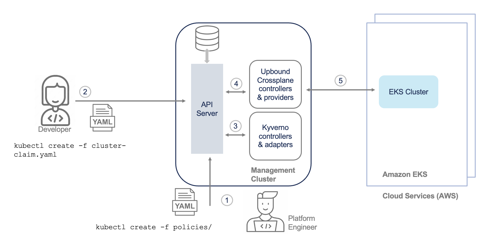

# Kyverno for Upbound Reference Platform 

This repository contains reference implementation of Nirmata Enterprise Kyverno policies for the [Upbound AWS Reference Platform](https://github.com/upbound/platform-ref-aws).

Kyverno policies in this repository have been created to work with the specific reference platform. These policies represent just a small subset of policies that can be created to ensure security and governance while enabling self-service provisioning of cloud infrastructure. 

## Overview

Kyverno is a policy engine designed for Kubernetes. It can validate, mutate, and generate configurations using admission controls and background scans. Kyverno policies are Kubernetes resources and do not require learning a new language. Kyverno is designed to work nicely with tools you already use like kubectl, kustomize, and Git.


Kyverno can be used with any Kubernetes-native solution. The image below describes how Kyverno can be used with Upbound Crossplane.




## Quickstart

### Prerequisites

Before installing Kyverno, follow this instructions in the Quickstart section of the [Upbound AWS Reference Platform](https://github.com/upbound/platform-ref-aws). Once you have verified that the AWS Reference Platform has been configured and working correctly, you can follow these steps.

### Install Kyverno

Install Kyverno to your cluster. Below is the command to install Kyverno. You can also refer to the [Kyverno documentation](https://kyverno.io/docs/installation/) for other options to install Kyverno

```console
kubectl create -f https://github.com/kyverno/kyverno/releases/download/v1.10.0/install.yaml
```

Verify that Kyverno pods are running

```console
 kubectl get pods -n kyverno
```

Note: In case the kyverno-admission-controller pod does not enter the running state and is constantly restarting, it is likely that it does not have sufficient memory. This is typically due to large number of custom resource definitions in the cluster. You can edit the kyverno-admission-controller deployment and increase the default memory limit to 1Gi. Once the change has been made, the pod should restart successfully.

```console
        resources:
          limits:
            memory: 1Gi
          requests:
            cpu: 100m
            memory: 128Mi
```

### Install Kyverno Policies

Clone this repository and install the policies from the 'policies' directory.

```console
 kubectl create -f ./policies/
```

Verify that the policies have been successfully installed and ready. All the sample policies have been configured in 'enforce' mode which means that any requests that fail the policies will be blocked.

```console
 kubectl get cpol
```

### Verify Policies

Now, you can verify that these policies are working.

To verify  the policies, you can make the following changes to [cluster-claim.yaml](https://github.com/upbound/platform-ref-aws/blob/main/examples/cluster-claim.yaml)
- Change node count to 5
- Change size to large

Now when you try to create the cluster by applying the cluster-claim.yaml, you should see the following:

```console
kubectl create -f cluster-claim.yaml
Error from server: error when creating "cluster-claim.yaml": admission webhook "validate.kyverno.svc-fail" denied the request:

resource Cluster/default/platform-ref-aws was blocked due to the following policies

limit-node-count-policy:
  limit-node-count: You cannot create a cluster with more than 3 nodes. Please reduce
    the node count and create the cluster.
restrict-node-size-policy:
  restrict-node-size: You cannot create a cluster with node size large Please change
    the node size to small or medium
validate-cluster-name-policy:
  validate-cluster-name: You can only create clusters with your department name as
    the prefix. Please change the cluster name.
```


🎉 Congratulations. You have just created and verified policies using Kyverno with your Upbound Crossplane powered platform!


## Questions?

For any questions, thoughts and comments don't hesitate to [reach
out](https://nirmata.com/contact-us/) or drop by to say hi on the Kyverno Slack channel: 
[[slack.nirmata.io](https://slack.k8s.io/)](https://slack.k8s.io/) and then search for the #kyverno channel.